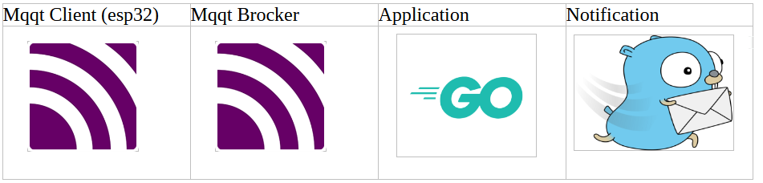

# Home-Security-Project 
# 
This projetc is not ready to deploiement ![Home-Security-Project]

Projet de sécurisation de domicile

Ce projet utilise un esp32c3 pour le capteur de porte.

Le capteur de porte utilise le topic (mqtt) Porte_ouverte pour avertir d'une intrusion.

## Topics Mqtt

Les topics sont accédés par les 2 sondes esp32, (porte et sirène), et par les 2 programmes GO

## Surveille_porte

On surveille le topic mqtt porte
Si la porte est ouverte et l'alarme armée, on positionne le topic mqtt alarme à 1.

## Surveille_Gotify_Messages

On survelle les message reçu par Gotify, si un message "Alarme ON" est reçu, on positionne le topic mqtt alarm armée à 1
si un message "Alarme OFF" est reçu, onposition le topic mqtt alarm armée à 0

