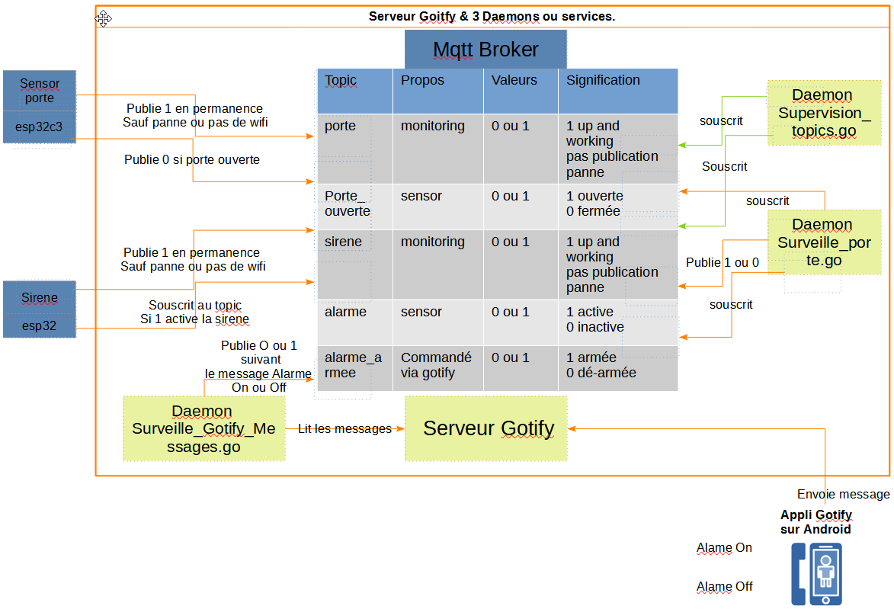

# Home-Security-Project 
# 
This projetc is not ready to deploiement ![Home-Security-Project]

## La stack 

##Projet de sécurisation de domicile

Ce projet utilise un esp32c3 pour le capteur de porte et un autre pour la Sirène.

Le capteur de porte utilise le topic (mqtt) Porte_ouverte pour avertir que la porte est ouverte.

La sirène utilise le le topic (mqtt) alarme, si alarme alors la sirène s'active.

Trois programmes Go 
 - Surveille_porte.go
 - Surveille_Gotify_Messages.go
 - Supervision_topics.go

## Architecture 

## Topics Mqtt

| Nom du Topic  | Propos        | Valeur  | Signification    | 
| ------------- |:-------------:| -------:| ----------------:|
| porte         | monitoring    |    1    | 1 up and working |
| sirene        | monitoring    |    1    | 1 up and working |
| porte_ouverte | sensor        |  0 ou 1 | 1 porte ouverte  |
| alarme        | sensor        |  0 ou 1 | 1 alarme activé  |
| alarme_armee  | sensesor      |  0 ou 1 | 1 alarme armée   |

Les topics sont accédés par les 2 sondes esp32, (porte et sirène), et par les 2 programmes GO

## Sonde esp32c3 porte

## Sonde esp32c3 Sirène

## Surveille_porte

On surveille le topic porte_ouverte, si la porte est ouverte et que le topic Alarme_armée=1,
 alors on publie 1 sur le topic alarme.

## Surveille_Gotify_Messages

On lit les message recu par gotify, 
  si l'on recoit le message Alarme On, on publie 1 sur alarme_armée.
  si l'on recoit le message Alarme Off, on publie 0 sur alarme_armée.

## Supervision_Topics.go
(supervision-topics.png)
  On surveille en souscrivant au topic porte et au topic sirene, que des 1 sont reçus régulièrement.
  Action si l'on ne reçoit plus : envoie d'une notification via Gotify.

# Support

    

# Test
**Etats des programmes**:

|  Programme    |  Developpement | Testing |  Production    |
| ---- | ---- | ---- | ---- |
| Surveille_porte.go             |   ❌   |  ❌ |  ͛ |
| Surveille_Gotify_Messages.go   |    en cours  |  ❌ |   s͛ |
| Supervision_topics.go          |    en cours  |  ❌ |     |
| Sonde_esp32c3_porte.lua        |    •         |  ✅ |   ͛ |
| Sonde_esp32c3_Sirène.lua       |    •         |  ✅ |  ͛ |

 
